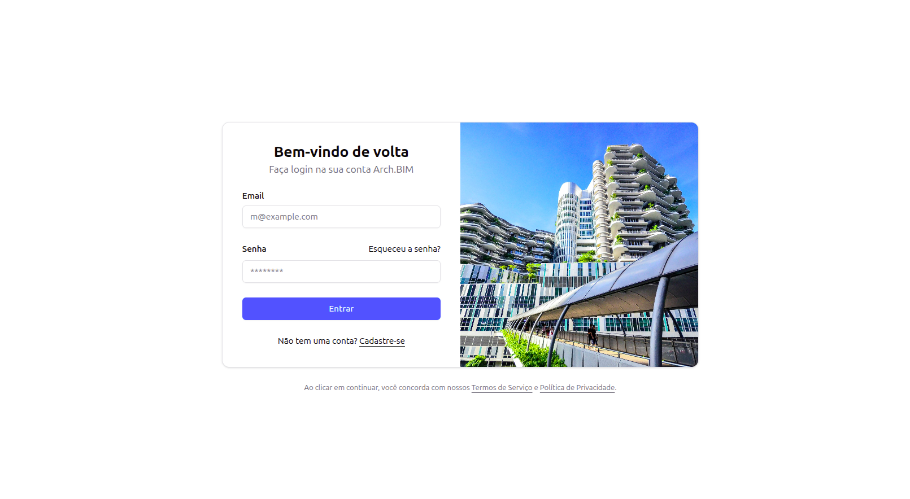
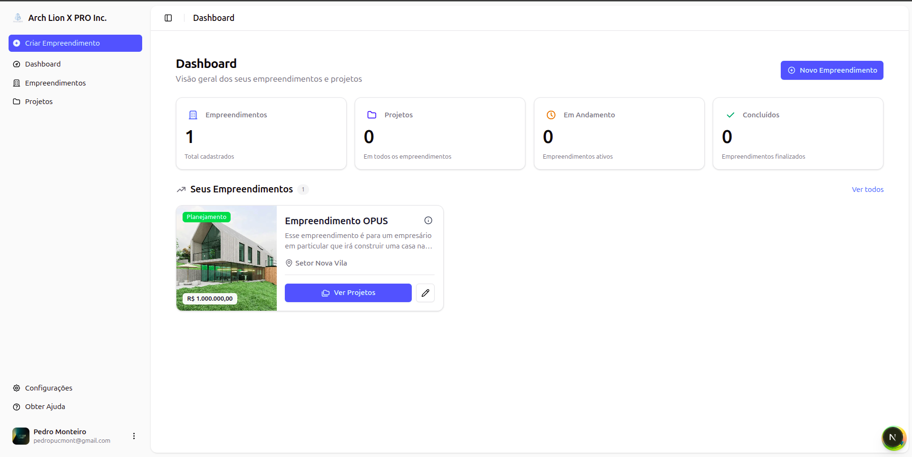
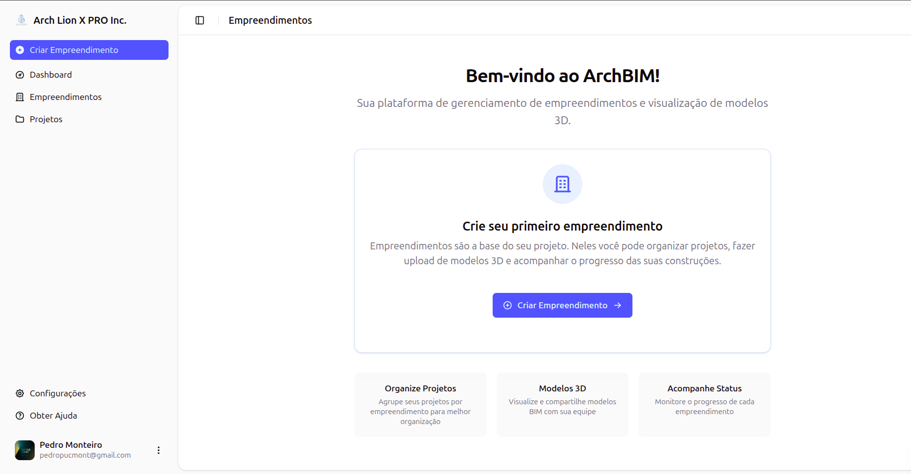
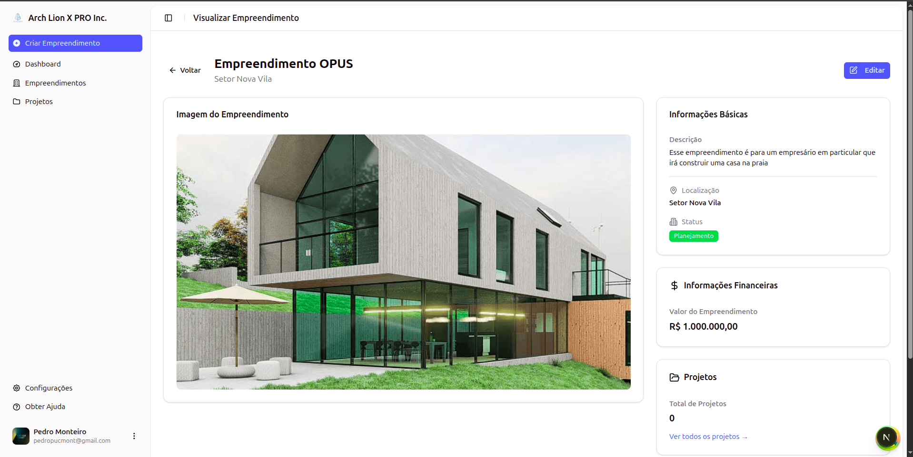
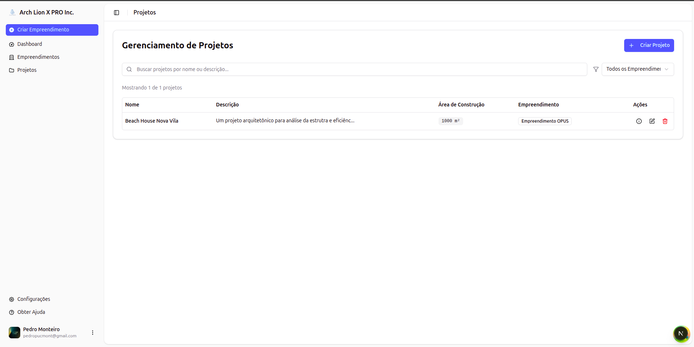
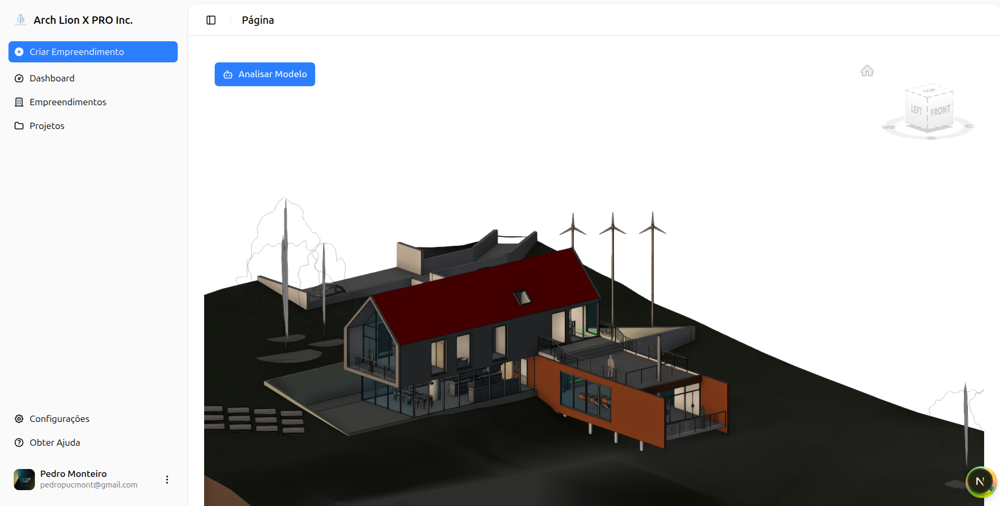
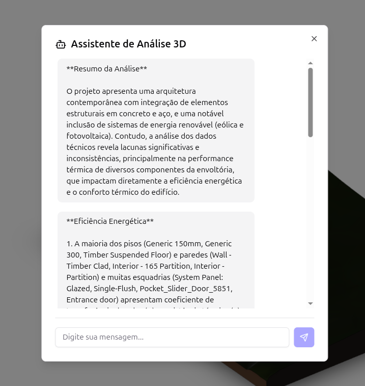
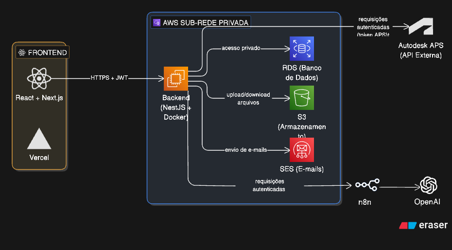
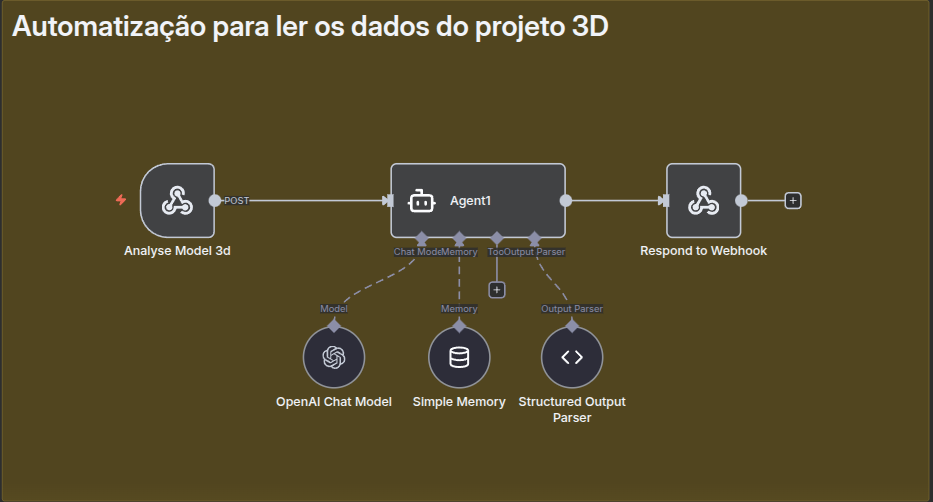
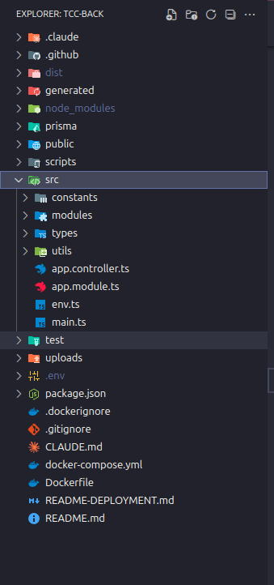

# arch.bim 

**Arch.BIM** is a full-stack platform for BIM-based building analysis and sustainable architecture management. It allows architecture firms and developers to manage real estate projects, upload and visualize 3D BIM models, and run AI-powered analysis on building metadata — all in one place.

Evolved from the **Lion X Pro** backend system.

## Tech Stack


> Next.js · React · NestJS · Node.js · TypeScript · PostgreSQL · Docker · Tailwind CSS · AWS · Autodesk APS · n8n · OpenAI

---

## Table of Contents

- [Overview](#overview)
- [Features](#features)
- [Screenshots](#screenshots)
- [Architecture](#architecture)
- [AI Integration](#ai-integration)
- [Backend Structure](#backend-structure)
- [Contact](#contact)

---

## Overview

Arch.BIM was built to bridge the gap between architectural project management and intelligent BIM analysis. The platform provides:

- A multi-tenant structure with **Enterprises** and **Projects**
- Integration with the **Autodesk APS API** to render and process 3D BIM models
- An **AI assistant** powered by OpenAI (via n8n automation) to analyze building metadata — including energy efficiency, thermal performance, and structural data
- Cloud infrastructure on **AWS** with private subnets, RDS, S3, and SES

---

## Features

- **Authentication** — Secure login with JWT
- **Enterprise Management** — Create and manage real estate enterprises with financial data, location, and images
- **Project Management** — Organize projects under enterprises, with construction area tracking and full CRUD
- **3D BIM Viewer** — Render and interact with 3D models via Autodesk APS integration
- **AI Analysis Assistant** — Automated pipeline (n8n + OpenAI) that reads 3D model metadata and returns structured architectural analysis
- **Dashboard** — Overview of enterprises, projects, active builds, and completed developments
- **Email Notifications** — Transactional emails via AWS SES
- **File Storage** — Model and image uploads via AWS S3

---

## Screenshots

### Login Page


### Dashboard


### Empty State — Enterprises


### Enterprise Detail View


### Project Manager


### 3D BIM Model Viewer


### AI Analysis Assistant


---

## Architecture

The full infrastructure runs on AWS with a private subnet isolating the backend services:



| Layer | Technology |
|---|---|
| Frontend | React + Next.js (Vercel) |
| Backend | NestJS + Docker (AWS) |
| Database | PostgreSQL (AWS RDS) |
| File Storage | AWS S3 |
| Email | AWS SES |
| AI Automation | n8n + OpenAI |
| 3D Models | Autodesk APS (External API) |

---

## AI Integration

The AI analysis pipeline uses **n8n** to automate the extraction of 3D model metadata and forward it to **OpenAI**, returning a structured architectural report with insights on:

- Energy efficiency of floors, walls, and openings
- Thermal performance gaps in the building envelope
- Structural components and material analysis



---

## Backend Structure

The backend follows a **Clean Architecture** approach with NestJS, organized by domain modules:



```
src/
├── constants/
├── modules/        # Domain modules (enterprises, projects, auth, etc.)
├── types/
├── utils/
├── app.module.ts
└── main.ts
```

---

## Contact

Pedro Monteiro
📧 [pedro.oliveira@monteirodev.com](mailto:pedro.oliveira@monteirodev.com)
🔗 [linkedin.com/in/opedro-monteiro](https://linkedin.com/in/opedro-monteiro)
